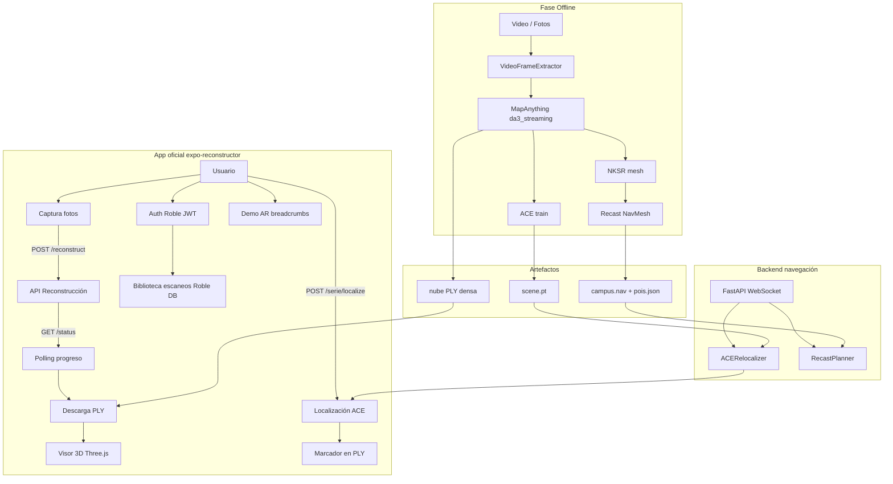
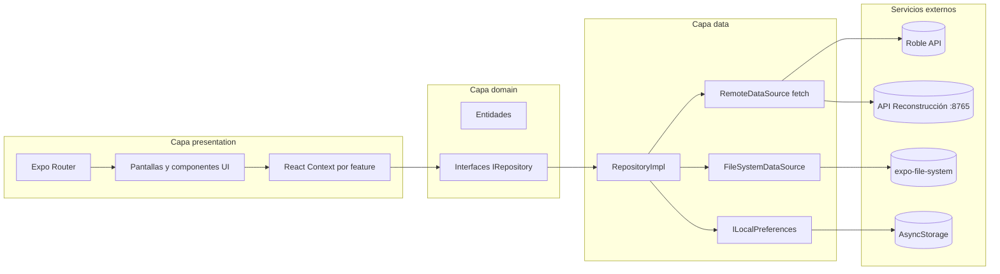
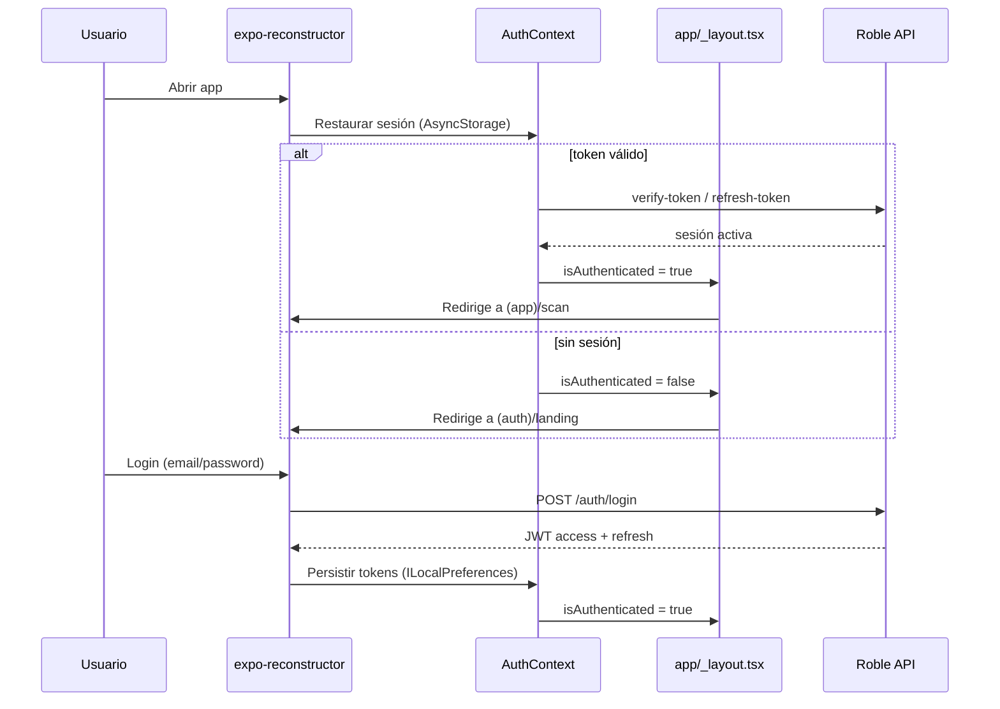
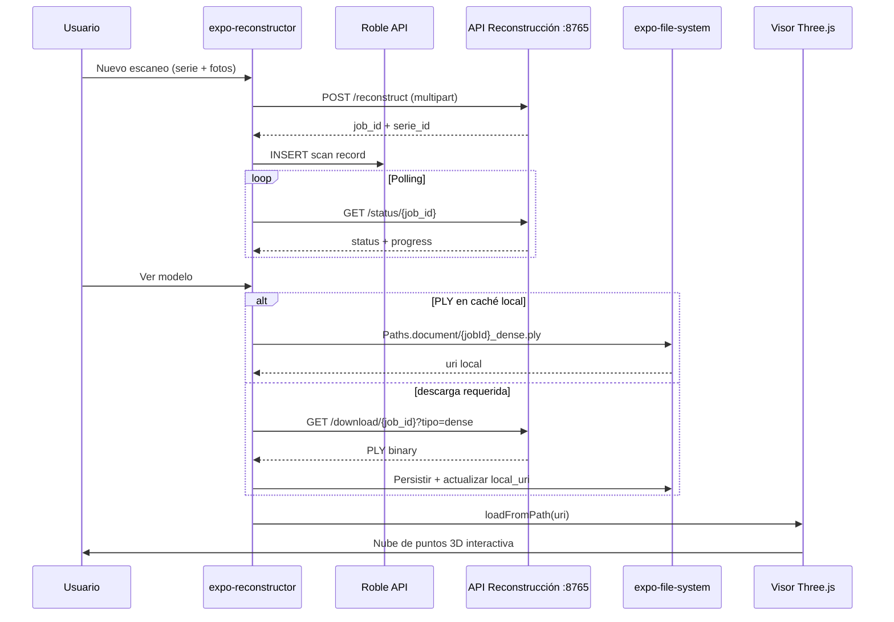

# UniWhere — Sistema Inteligente de Navegación Indoor Mediante Realidad Aumentada y Nubes de Puntos

**Universidad del Norte – Departamento de Ingeniería de Sistemas y Computación**  
**Proyecto Final – INV 7363**

**Flavio Andres Arregoces Mercado** — [arregocesf@uninorte.edu.co](mailto:arregocesf@uninorte.edu.co)  
**Cristian David González Franco** — [francocd@uninorte.edu.co](mailto:francocd@uninorte.edu.co)  
**Jorge Luis Sánchez Barreneche** — [jlbarreneche@uninorte.edu.co](mailto:jlbarreneche@uninorte.edu.co)
**Barranquilla, Colombia – 2026**

**Palabras clave:** Indoor Navigation, Augmented Reality, Point Clouds, Wayfinding, Localization, Mobile Computing

---

## Tabla de Contenidos

1. [Introducción](#1-introducción)
2. [Marco Conceptual](#2-marco-conceptual)
3. [Planteamiento del Problema](#3-planteamiento-del-problema)
4. [Objetivos](#4-objetivos)
5. [Estado del Arte](#5-estado-del-arte)
6. [Requerimientos](#6-requerimientos)
7. [Diseño y Arquitectura](#7-diseño-y-arquitectura)
8. [Implementación](#8-implementación)
9. [Despliegue y Operación](#9-despliegue-y-operación)
10. [Validación](#10-validación)
11. [Resultados y Discusión](#11-resultados-y-discusión)
12. [Referencias](#12-referencias)

---

## 1. Introducción

Recientemente, la navegación en espacios interiores complejos se ha consolidado como una frontera crítica en interacción humano-computadora y sistemas inteligentes de información geográfica. En infraestructuras universitarias, los sistemas de posicionamiento global no pueden resolver de forma confiable la orientación en entornos cerrados: las señales satelitales son atenuadas por muros y carecen de resolución vertical para distinguir plantas en edificios multinivel [1][2]. Esta limitación afecta de manera particular a usuarios nuevos —estudiantes en su primer semestre, visitantes, personal de otras dependencias— quienes deben orientarse en campus con múltiples bloques, corredores extensos y distribuciones repetitivas de espacios.

En el campus de la Universidad del Norte (Barranquilla, Colombia), el problema se manifiesta en pérdida de tiempo, estrés de orientación y subutilización de recursos físicos como laboratorios y salas de servicio ubicadas en zonas poco señalizadas. Los sistemas de señalización estática no ofrecen rutas personalizadas ni se adaptan a la posición del usuario. La Realidad Aumentada Móvil (MAR) ha demostrado reducir la carga cognitiva del usuario en un 35% frente a métodos tradicionales de wayfinding [1], lo que motiva su integración con procesamiento de nubes de puntos y relocalización visual pura sobre mapas precomputados.

UniWhere propone resolver este problema mediante un sistema de navegación indoor que opera sin infraestructura fija. El desarrollo del prototipo se articula en cinco etapas conceptuales:

1. **Digitalización del entorno:** captura fotográfica o videográfica del campus y generación de nubes de puntos 3D densas mediante reconstrucción feed-forward (Depth Anything 3 / MapAnything).
2. **Preprocesamiento geométrico:** filtrado, conversión a malla de superficie (NKSR) y generación de NavMesh navegable (Recast/Detour).
3. **Relocalización visual:** estimación de pose 6-DoF en tiempo real mediante ACE sobre el mapa precomputado.
4. **Motor de navegación:** cálculo de rutas óptimas, monitorización del recorrido y reencaminamiento automático ante desviaciones.
5. **Presentación al usuario:** visualización de modelos 3D y, en la visión completa del sistema, superposición AR de instrucciones direccionales sobre la cámara del dispositivo.

El **cliente móvil oficial** del proyecto es **`expo-reconstructor`** (`app/expo-reconstructor/`), submódulo Git basado en **Expo SDK 55 / React Native 0.83** (commit `6882e37`, rama `main`), que materializa las etapas 1 y 5: autenticación JWT (Roble OpenLab), captura fotográfica, reconstrucción remota, biblioteca de escaneos con miniaturas en caché, descarga y caché local offline-first de PLY, visor 3D interactivo con Three.js, **localización visual puntual** (`POST /{serie}/localize`) con marcador en el visor PLY, y **AR pseudo-inmersiva** con cámara (`expo-camera`) + breadcrumbs GLB sobre `@react-three/fiber`. La app sigue **Clean Architecture** por features con DI manual (`DIProvider`), comunicación HTTP vía `fetch` nativo (sin cliente externo), almacenamiento unificado (`AsyncStorage` + `expo-file-system`) y suite de pruebas con **Jest + MSW** (umbral de cobertura 70 %). Las etapas 2–4 se ejecutan en el servidor: pipeline offline (`preprocesamiento/`) y dos servicios FastAPI separados — **`backend/reconstruct_api.py`** (puerto 8765: reconstrucción, localización ACE y descarga PLY, consumido por Expo) y **`backend/service/`** (puerto 8000: WebSocket de navegación continua). La **navegación continua en tiempo real** (WebSocket frame-a-frame + guía paso a paso sobre NavMesh) se valida además en el prototipo complementario Flutter (`app/flutter-ar/`).

El presente documento describe el diseño, la arquitectura y el estado de implementación del prototipo funcional, siguiendo la metodología de investigación longitudinal con revisión PRISMA y el marco de desarrollo ágil Scrum del entregable académico del proyecto.

---

## 2. Marco Conceptual

### 2.1 Realidad Aumentada y Realidad Aumentada Móvil

La Realidad Aumentada es una tecnología que superpone contenido digital generado por computadora sobre el entorno físico en tiempo real, manteniendo un registro espacial preciso entre los objetos virtuales y el mundo real. Este registro espacial es lo que distingue a la AR de una simple superposición de imágenes: los elementos digitales permanecen anclados a posiciones físicas concretas aunque el usuario se desplace o cambie su punto de vista.

En dispositivos móviles, esta integración se realiza a través de la cámara del smartphone, lo que elimina la necesidad de hardware especializado. Su aplicación en navegación busca reducir la carga cognitiva del usuario al proyectar las instrucciones directamente sobre el entorno que está viendo, facilitando el desarrollo de mapas mentales del espacio de manera más natural que los mapas bidimensionales tradicionales [1][2].

### 2.2 Navegación Indoor y Wayfinding

El wayfinding es el proceso cognitivo mediante el cual una persona interpreta su entorno, construye una representación mental del espacio y toma decisiones para orientarse hacia un destino. Los sistemas tecnológicos de navegación buscan asistir este proceso proporcionando información espacial en el momento y el formato adecuados.

La navegación indoor es el problema técnico de determinar la posición de un usuario dentro de un edificio y guiarlo hacia un punto de interés. A diferencia de la navegación exterior, donde el GPS constituye la solución estándar, en espacios cerrados las señales satelitales son insuficientes, lo que obliga a los sistemas a resolver de manera independiente tres componentes: determinar dónde está el usuario, calcular el camino más eficiente hacia su destino, y comunicar ese camino de forma clara e intuitiva.

### 2.3 Reconstrucción 3D y Relocalización Visual

Para operar sin infraestructura fija, el sistema requiere dos capacidades que actúan en momentos distintos. La primera es la reconstrucción tridimensional del entorno, que ocurre de manera offline antes de que el sistema entre en operación. A partir de un video de recorrido por el espacio, se genera una representación densa del entorno en forma de nube de puntos, que captura la geometría y la apariencia visual del lugar con suficiente detalle para servir como mapa de referencia.

La segunda capacidad es la relocalización visual, que ocurre en tiempo real durante la navegación. Cuando el usuario apunta la cámara de su dispositivo al entorno, el sistema compara lo que ve con el mapa precomputado y estima la posición y orientación de la cámara con seis grados de libertad: tres de traslación —dónde está el dispositivo en el espacio— y tres de rotación —hacia dónde apunta. Esta estimación, conocida como pose 6-DoF, es el dato que permite anclar las instrucciones de navegación al espacio físico con precisión submétrica.

### 2.4 SLAM Visual

El SLAM Visual (Simultaneous Localization and Mapping) es la familia de técnicas que permite a un dispositivo construir un mapa de un entorno desconocido y localizar su posición dentro de ese mapa de manera simultánea, usando únicamente la cámara como sensor. Los sistemas modernos de SLAM enfrentan tres desafíos interdependientes [3]: la necesidad de procesar imágenes a la velocidad de captura para evitar errores de seguimiento, la gestión concurrente de módulos que acceden a un mapa global compartido, y la capacidad de adaptar su comportamiento a condiciones variables como cambios de iluminación o velocidad de movimiento del usuario.

En UniWhere, las técnicas de SLAM fundamentan la fase de reconstrucción offline del campus y el refinamiento continuo de la estimación de posición durante la navegación, complementando los resultados del módulo ACE de relocalización visual.

### 2.5 Nubes de Puntos y Malla Navegable

Una nube de puntos es una representación tridimensional del entorno compuesta por un conjunto de puntos con coordenadas espaciales y, opcionalmente, información de color e intensidad. Constituye la salida natural del proceso de reconstrucción 3D a partir de video y proporciona una descripción geométrica densa del espacio físico.

Sin embargo, una nube de puntos no es directamente utilizable para calcular rutas de navegación, ya que representa el entorno como un conjunto de puntos sin distinción entre zonas transitables y obstáculos. Para resolver esto se genera una malla navegable —NavMesh— que segmenta el espacio en zonas por las que un usuario puede desplazarse. Sobre esta malla, algoritmos de búsqueda de caminos calculan la trayectoria óptima entre la posición actual del usuario y su destino, con soporte para reencaminamiento automático ante desviaciones.

### 2.6 Gobernanza de Datos

La gobernanza de datos en un sistema basado en AR y nubes de puntos debe asegurar calidad, integridad y privacidad del flujo de información sensorial:

1. **Gestión de calidad y procesamiento:** las nubes de puntos crudas contienen ruido y redundancias. El pipeline offline aplica filtrado, reconstrucción NKSR y validación de artefactos antes de publicar modelos al backend y a la app móvil.
2. **Privacidad y seguridad del usuario:** la autenticación JWT en Roble OpenLab y la persistencia de escaneos por usuario limitan el acceso a datos de captura. Las ubicaciones en tiempo real del servicio de navegación WebSocket requieren políticas de exposición controlada en despliegues multi-usuario.
3. **Integridad en almacenamiento y ciclo de vida:** el visor PLY de `expo-reconstructor` utiliza caché local (`expo-file-system` en nativo, Cache API en web) con parser streaming de 80 000 vértices por chunk. Los modelos ACE se entrenan con división train/test (relación 4:1) durante el preprocesamiento offline.

---

## 3. Planteamiento del Problema

### 3.1 Descripción del Problema

La navegación precisa en infraestructuras universitarias complejas representa un desafío para el cual los sistemas actuales no ofrecen soluciones satisfactorias. El GPS —estándar en exteriores— muestra deficiencias críticas en resolución espacial vertical y precisión de posicionamiento interior, lo que impide localizar con exactitud puntos de interés como laboratorios, aulas o estaciones de trabajo [1][3].

El problema se agrava en entornos con estructuras repetitivas o pasillos con texturas pobres, donde los métodos de posicionamiento tradicionales fallan al no poder distinguir variaciones mínimas en la escena [4]. Factores dinámicos como los cambios bruscos de iluminación y el movimiento de personas obstruyen la visión de la cámara, exigiendo técnicas avanzadas de estimación de pose [5]. Las nubes de puntos 3D recolectadas suelen ser incompletas por oclusiones, lo que degrada el rendimiento de las aplicaciones de navegación si no se cuenta con sistemas de completado automático [6].

**Pregunta central:** ¿Cómo desarrollar un sistema de wayfinding inteligente basado en AR y nubes de puntos 3D que permita la localización precisa de usuarios en campus universitarios sin depender de infraestructura GPS ni de balizas fijas?

### 3.2 Restricciones y Supuestos de Diseño

**Restricciones técnicas:**

- El sistema debe operar sin señal GPS y sin infraestructura WiFi fija ni balizas BLE para la localización visual.
- La latencia del pipeline de reconstrucción remota (envío de fotos → modelo PLY disponible) debe ser aceptable para uso interactivo en campus (< 45 min por serie en servidor GPU).
- El dispositivo objetivo es un smartphone Android o iOS de gama media; la app oficial también opera en web mediante Expo.
- El mapa 3D del campus se genera en el servidor de preprocesamiento; la app móvil se conecta a la **API de reconstrucción** (`backend/reconstruct_api.py`, puerto 8765) y a la plataforma Roble (OpenLab) para persistencia de escaneos.

**Restricciones de alcance:**

- La primera versión del prototipo cubre uno o dos bloques del campus de la Universidad del Norte.
- La app oficial incluye localización ACE por foto única y demo AR con breadcrumbs; la **navegación continua** WebSocket frame-a-frame se valida en el prototipo complementario (`app/flutter-ar/`).
- El módulo de asistencia por voz con LLM queda como trabajo futuro planificado.

**Restricciones normativas:** El proyecto es estrictamente académico y no comercial.

**Supuestos:**

- El entorno presenta suficiente riqueza de texturas para que la relocalización visual sea estable en la mayoría de pasillos.
- Los usuarios cuentan con un smartphone con cámara trasera de al menos 12 MP.
- La iluminación interior de los edificios es suficiente para capturas fotográficas utilizables en reconstrucción 3D.

### 3.3 Alcance

**Incluido en el prototipo actual:**

- Pipeline offline de reconstrucción 3D del entorno (video/fotos → nube de puntos → malla NKSR → NavMesh Recast → modelo ACE).
- Módulo de relocalización visual 6-DoF mediante ACE en servidor GPU.
- Motor de rutas sobre NavMesh con reencaminamiento automático (servicio backend).
- Servicio backend FastAPI con protocolo WebSocket para navegación en tiempo real.
- **App móvil oficial `expo-reconstructor`:** autenticación JWT (Roble), captura fotográfica, reconstrucción remota vía `backend/reconstruct_api.py`, biblioteca de escaneos con portadas en caché offline-first, localización visual puntual con marcador en visor PLY, demo AR con breadcrumbs GLB (`expo-camera` + R3F), descarga y caché local de PLY, visor 3D interactivo con Three.js, tests Jest/MSW.

**Excluido o planificado como trabajo futuro:**

- Navegación continua WebSocket frame-a-frame y guía paso a paso integrada en `expo-reconstructor` (actualmente en prototipo `flutter-ar`).
- Anclaje AR nativo ARCore/ARKit con flechas sobre el mundo real en Expo (la demo actual usa pseudo-AR con cámara + overlay R3F).
- Módulo de asistencia por voz con procesamiento de lenguaje natural (LLM).
- Prototipo complementario `flutter-ar` para validación de navegación AR continua con ARCore y WebSocket.
- Segmentación semántica 3D del entorno.
- Observabilidad con métricas de latencia y trazas por sesión (OpenTelemetry, Prometheus, Grafana).

### 3.4 Justificación

**Justificación técnica:** los avances en SLAM visual y relocalización basada en coordenadas de escena (ACE [29]) permiten precisión submétrica con cámaras RGB comerciales, sin balizas fijas [2][10]. La integración de nubes de puntos 3D supera al mapeo 2D tradicional [6][7].

**Justificación académica y de HCI:** la AR reduce la carga cognitiva en tareas de navegación [1] y facilita mapas cognitivos internos. Los marcos MAR actuales integran interfaces centradas en el usuario [2][12]. El benchmarking de reconstructores (COLMAP [22], MUSt3R [25], MapAnything [23], Depth Anything 3 [24]) fundamentó la selección del pipeline offline del proyecto.

---

## 4. Objetivos

### Objetivo General

Construir un sistema híbrido cliente-servidor de navegación indoor que genere mapas 3D del campus offline (MapAnything → NKSR → Recast → ACE), relocalice usuarios en tiempo real sobre esos mapas (ACE 6-DoF + NavMesh), y exponga la experiencia móvil mediante **`expo-reconstructor`** (Expo/React Native), sin depender de GPS ni balizas fijas.

### Objetivos Específicos

| ID | Objetivo técnico | Entregable / criterio de cumplimiento |
|----|------------------|---------------------------------------|
| **OE1** | **Fundamentar y seleccionar el stack de visión por computador** del proyecto a partir del estado del arte en SLAM visual, reconstrucción 3D feed-forward y relocalización RGB. | RSL PRISMA (67 artículos, 2020–2026). Selección documentada de **ACE** (relocalización), **MapAnything/DA3** (`da3_streaming` default, `da3_nested` alta fidelidad), **NKSR + Recast** (NavMesh) y **FastAPI/WebSocket** (navegación continua). |
| **OE2** | **Diseñar la arquitectura de cuatro capas** con contratos de datos entre captura móvil, preprocesamiento GPU, núcleo de localización y presentación. | Diagramas y configuración en `infra/scenes.yaml`. Pipeline offline: `video → MapAnything → ACE train → NKSR → Recast`. Backend navegación: `FramePipeline` (ACE + LocalizationFSM + RecastPlanner). API reconstrucción: `backend/reconstruct_api.py`. Cliente: `expo-reconstructor` (Roble JWT, `/reconstruct`, `/{serie}/localize`, visor PLY Three.js). |
| **OE3** | **Implementar el prototipo end-to-end** integrando pipeline, backend y app móvil oficial. | **Pipeline:** `preprocesamiento/pipelines/pipeline.sh` operativo. **Backend navegación:** FastAPI `backend/service/` con WebSocket `/v1/ws/realtime`, REST `/v1/relocalize/single`, `/v1/route/plan`. **API reconstrucción:** `backend/reconstruct_api.py` (`uv run backend-reconstruct`, puerto 8765). **App Expo:** features `auth`, `scan`, `reconstruction`, `localization`, `viewer`, `ar` + tests Jest/MSW (commit `6882e37`). **Prototipo AR continuo:** `app/flutter-ar` (ARCore + WebSocket). |
| **OE4** | **Validar precisión, rendimiento y usabilidad** del stack elegido frente a alternativas y en condiciones reales de campus. | **Benchmarking reconstructores:** COLMAP vs MUSt3R vs MapAnything/DA3. **Localización ACE:** error < 1 m (Bloques I y C, UniNorte). **Latencia E2E navegación:** < 300 ms (frame → pose en LAN). **Tests:** pytest backend (FSM, GuidanceEngine, schemas WS); verificación manual flujos Expo; evaluación Likert (ISO 9126 / ISO 15504). |

Cada objetivo específico se vincula directamente con los requerimientos de la sección 6 y con los resultados reportados en la sección 11.

---

## 5. Estado del Arte

La revisión sistemática de la literatura se realizó siguiendo las directrices PRISMA, consultando ACM Digital Library, IEEE Xplore, Web of Science y Springer Link. Tras aplicar criterios de inclusión (publicaciones 2020–2026, componente experimental, acceso completo), se seleccionaron 67 artículos.

### 5.1 Navegación Indoor con Realidad Aumentada

Qiu et al. [1] presentan la revisión más completa sobre AR en wayfinding humano (2025), demostrando una reducción del 35% en carga cognitiva respecto a métodos tradicionales. Cao et al. [2] analizan 55 marcos de AR móvil, destacando que la eficiencia del sistema depende del equilibrio entre procesamiento local y respuesta visual. Manju et al. [12] validan una implementación práctica de navegación indoor con AR en campus inteligentes. La limitación central de los sistemas actuales es la dependencia de infraestructura fija para la localización, restricción que este proyecto elimina.

### 5.2 Reconstrucción 3D y Relocalización Visual

Brachmann et al. [29] introducen ACE (Accelerated Coordinate Encoding), sistema que regresa coordenadas de escena 3D directamente desde imágenes RGB mediante una red neuronal liviana, estimando la pose 6-DoF vía PnP+RANSAC. ACE entrena modelos específicos de escena en minutos y los comprime en archivos de apenas 4 MB, lo que lo hace adecuado para despliegue en servidor con múltiples escenas. Keetha et al. [23] presentan MapAnything, sistema feed-forward de reconstrucción 3D métrica utilizado en el pipeline offline. Lin et al. [24] desarrollaron Depth Anything 3 (DA3), base del ecosistema MapAnything; el modelo **DA3-Nested** (`da3_nested`) se reserva para reconstrucciones de alta fidelidad (+35.7% precisión reportada frente a métodos previos), mientras **`da3_streaming`** es el reconstructor por defecto del pipeline por su menor demanda de VRAM. Huang et al. [28] proponen NKSR para convertir nubes de puntos en mallas de superficie. Schönberger et al. [22] y Cabon et al. [25] representan alternativas evaluadas (COLMAP/SfM y MUSt3R) durante el benchmarking de reconstructores del OE4.

### 5.3 Pathfinding y Navegación sobre NavMesh

Madushanka y Madushanka [32] proponen pathfinding A* multi-hilo sobre NavMesh Recast para entornos de navegación dinámica, validando la escalabilidad del enfoque en escenarios complejos. Recast/Detour constituye la biblioteca de referencia para generación de mallas navegables y pathfinding en entornos 3D, con soporte para cambios de planta y reencaminamiento dinámico.

### 5.4 Robustez y Condiciones Adversas

Semenova et al. [3] realizan el estudio más completo de desafíos sistémicos en SLAM visual (ACM Surveys 2024), identificando la latencia, la concurrencia y la adaptación al contexto como los tres problemas fundamentales. Zhao et al. [5] optimizan la estimación de pose combinando cámaras de eventos y RGB para condiciones de iluminación extrema. Dasari et al. [9] presentan RoVaR, sistema de seguimiento multi-agente con diversidad visual y RF que elimina la acumulación de errores en trayectorias largas.

### 5.5 Brecha Identificada

La literatura muestra escasez de prototipos que combinen sin infraestructura fija: reconstrucción 3D desde video de smartphone, relocalización visual de alta precisión, generación automatizada de NavMesh y guía AR en tiempo real sobre hardware móvil comercial. UniWhere integra estas capacidades en un sistema orientado específicamente al entorno de campus universitario.

---

## 6. Requerimientos

### 6.1 Funcionales

| ID | Requerimiento | Componente |
|----|--------------|------------|
| RF-01 | El sistema debe permitir registro, inicio de sesión y recuperación de contraseña de usuarios. | `expo-reconstructor` / Roble API |
| RF-02 | El usuario debe poder capturar o seleccionar fotografías del entorno y enviarlas al servicio de reconstrucción 3D. | `expo-reconstructor` / API `/reconstruct` |
| RF-03 | El sistema debe mostrar el progreso del job de reconstrucción hasta completarse o fallar. | `expo-reconstructor` / API `/status/{job_id}` (estados: `pending` → `reconstructing` → `training` → `done`) |
| RF-04 | El usuario debe poder visualizar nubes de puntos PLY en un visor 3D interactivo (rotación, zoom). | `expo-reconstructor` / feature `viewer` |
| RF-05 | El sistema debe persistir y listar los escaneos del usuario (serie, job, tipo, URI local). | `expo-reconstructor` / Roble DB |
| RF-06 | El usuario debe poder descargar y cachear localmente el PLY resultante para visualización offline. | `expo-reconstructor` / `ScanScreen` |
| RF-07 | El usuario debe poder localizar su posición enviando una foto a la API ACE y visualizar el punto estimado sobre el modelo PLY. | `expo-reconstructor` / feature `localization` |
| RF-08 | El usuario debe poder visualizar rutas de navegación mediante breadcrumbs AR sobre la cámara del dispositivo (demo). | `expo-reconstructor` / feature `ar` |
| RF-09 | El pipeline offline debe generar el modelo 3D del campus a partir de video o fotos de recorrido. | `preprocesamiento/` |
| RF-10 | El backend debe estimar pose 6-DoF y calcular rutas sobre NavMesh (servicio de navegación). | `backend/service/` |

### 6.2 No Funcionales

| ID | Requerimiento |
|----|--------------|
| RNF-01 | Latencia de respuesta de la API de reconstrucción (aceptación de job) < 10 min en red universitaria. |
| RNF-02 | Precisión de localización ACE ≤ 1 m de error en condiciones normales de iluminación interior. |
| RNF-03 | Latencia E2E del servicio de navegación (frame recibido → pose devuelta) < 300 ms en red universitaria. |
| RNF-04 | Compatibilidad multiplataforma: Android, iOS y web (Expo SDK 55). |
| RNF-05 | El código del cliente oficial debe seguir Clean Architecture (domain / data / presentation) con DI manual y suite de pruebas Jest/MSW. |
| RNF-06 | Escalabilidad para nuevos edificios o POIs mediante configuración en `scenes.yaml`. |
| RNF-07 | El servidor de navegación debe soportar múltiples sesiones concurrentes con LRU cache de máximo 2 escenas en VRAM. |
| RNF-08 | El visor PLY debe procesar nubes de puntos binarias con submuestreo automático cuando superen 80 000 vértices. |

---

## 7. Diseño y Arquitectura

### 7.1 Evaluación de Alternativas

#### Cliente móvil oficial

Se evaluaron Flutter, React Native (Expo) y desarrollo nativo Android. **Expo SDK 55 con React Native** fue seleccionado como stack de la **app oficial** (`expo-reconstructor`), alineado con la decisión del entregable académico de usar frameworks multiplataforma tipo React Native para la capa de presentación móvil. Ventajas decisivas:

- Despliegue multiplataforma (Android, iOS, web) desde un único codebase TypeScript.
- Integración con **Three.js** y `@react-three/fiber` para el visor de nubes de puntos PLY en el dispositivo.
- Captura fotográfica nativa (`expo-image-picker`) y envío multipart al servicio de reconstrucción — funcionalidad central del Sprint 3 del proyecto.
- Conexión a **Roble** (OpenLab UniNorte) para autenticación JWT y persistencia de escaneos.
- **Clean Architecture** con inyección de dependencias manual (`DIProvider`) y React Context por feature.
- UI con **NativeWind v4** y componentes **react-native-reusables**; red exclusivamente con **`fetch`** nativo (sin Axios).
- Estrategia **offline-first parcial**: caché de portadas, PLY en disco (`expo-file-system`) y reutilización local antes de re-descargar.
- Suite de pruebas automatizadas (**Jest + jest-expo + MSW + Testing Library**) con `DIProvider overrides` para mocks.

**Flutter con ARCore** se mantiene en `app/flutter-ar/` como **prototipo complementario** para navegación continua WebSocket frame-a-frame con anclaje nativo; la app Expo ya incluye localización puntual y demo AR pseudo-inmersiva con breadcrumbs GLB.

#### Motor de relocalización

ACE (*Accelerated Coordinate Encoding*) fue seleccionado frente a SE-ResNeXt y DSAC* porque regresa coordenadas de escena 3D directamente desde imagen RGB, estima la pose 6-DoF vía OpenCV PnP+RANSAC sin dependencias de compilación especial, y almacena cada escena como un archivo `.pt` de ~4 MB. Al operar en GPU con precisión FP16, la inferencia se completa en menos de 50 ms por frame.

#### Reconstructor 3D offline

Se evaluaron COLMAP [22], MUSt3R [25], SLAM3R [16], MapAnything [23] y variantes Depth Anything 3 [24]. **MapAnything con `da3_streaming`** es el reconstructor por defecto del pipeline oficial por operación feed-forward, escala métrica consistente y menor demanda de VRAM. **`da3_nested` (DA3-Nested)** se reserva para reconstrucciones de alta fidelidad cuando el presupuesto de GPU lo permite. COLMAP queda disponible como alternativa legacy para fusiones multi-serie.

#### Generación de NavMesh

NKSR convierte la nube de puntos densa en malla de superficie; **Recast Navigation** genera el NavMesh binario navegable y los POIs asociados. Se descartó pathfinding sobre la nube de puntos cruda por la imposibilidad de distinguir zonas transitables de obstáculos.

### 7.2 Arquitectura

#### 7.2.1 Descripción General de la Arquitectura

UniWhere sigue una **arquitectura cliente-servidor híbrida** organizada en **cuatro capas lógicas**, según el diseño del entregable académico:

| Capa | Responsabilidad | Implementación en el repositorio |
|------|----------------|----------------------------------|
| **1. Captura e ingesta** | Adquisición de fotogramas y metadatos desde el smartphone | `expo-reconstructor`: `PhotoPicker`, localización por foto |
| **2. Preprocesamiento** | Reconstrucción 3D, malla NKSR, NavMesh Recast | `preprocesamiento/pipelines/pipeline.sh`: MapAnything (da3_streaming / da3_nested) → NKSR → Recast |
| **3. Relocalización y núcleo** | Estimación pose 6-DoF, FSM de localización, planificación de rutas | `backend/service/`: ACERelocalizer; API `POST /{serie}/localize` consumida por Expo |
| **4. Navegación y presentación** | Visualización 3D, guía AR, gestión de escaneos | `expo-reconstructor`: visor PLY, localización con marcador, demo AR breadcrumbs; navegación continua en `flutter-ar`, aun sin probar |

El sistema opera en **dos fases temporalmente separadas**:

1. **Fase offline (preprocesamiento):** video o fotos del campus → artefactos persistentes (`scene.pt`, `campus.nav`, `pois.json`, PLY denso).
2. **Fase interactiva:** el usuario captura fotos, solicita localización puntual o explora modelos PLY desde `expo-reconstructor`; la demo AR superpone breadcrumbs sobre la cámara. La app Expo consume la **API de reconstrucción** (`backend/reconstruct_api.py`, puerto 8765) para jobs 3D y localización ACE. Paralelamente, el **servicio de navegación** (`backend/service/`, puerto 8000) expone WebSocket continuo (latencia E2E < 300 ms), consumido por `flutter-ar`.

La **app móvil oficial** vive en `app/expo-reconstructor/` como submódulo Git del repositorio [jorgeluissanchez/uniwhere](https://github.com/jorgeluissanchez/uniwhere).

#### 7.2.2 Componentes del Sistema e Interacción

##### 7.2.2.1 Descripción de Componentes

**App móvil oficial — `expo-reconstructor`:** Cliente Expo/React Native con siete features principales. Corresponde a RF-01–RF-08.

| Feature | Responsabilidad | Archivos clave |
|---------|----------------|----------------|
| `auth` | Login, registro, recuperación de contraseña vía Roble JWT | `auth-remote-data-source-impl.ts`, `auth-context.tsx` |
| `scan` | CRUD de escaneos, miniaturas en caché (AsyncStorage), FAB localización | `scan-screen.tsx`, `new-scan-drawer.tsx` |
| `reconstruction` | Envío de fotos, polling de estado del job | `reconstruction-remote-data-source-impl.ts` |
| `viewer` | Parser PLY streaming + renderizado Three.js + marcador opcional | `ply-streaming-parser-data-source-impl.ts`, `point-cloud-canvas.tsx` |
| `localization` | Localización puntual ACE, resultado sobre PLY | `localization-remote-data-source-impl.ts`, `localization-result-screen.tsx` |
| `ar` | Demo AR: grid interactivo, breadcrumbs GLB, ruta sobre cámara | `ar-route-screen.tsx`, `breadcrumb-model.tsx` |
| `settings` | Perfil y configuración del usuario | `settings-screen.tsx` |

**Capa de preprocesamiento (pipeline offline):** Orquestador `pipeline.sh` ejecuta VideoFrameExtractor → MapAnything → ACE train → NKSR → Recast. Corresponde a RF-09.

**Servicio de navegación (`backend/service/`):** FastAPI + WebSocket para relocalización ACE continua, FSM de localización, GuidanceEngine y RecastPlanner. Corresponde a RF-10, RF-11. La app Expo consume relocalización puntual vía `POST /{serie}/localize` en la API de reconstrucción.

**Prototipo `flutter-ar`:** App Flutter con ARCore que consume el WebSocket de navegación para validar guía AR en tiempo real (no es la app oficial de entrega).



##### 7.2.2.2 Interacción entre Módulos

El flujo de datos entre componentes sigue contratos bien definidos:

| De → A | Mecanismo | Formato |
|--------|-----------|---------|
| App → Roble Auth | HTTP REST | JWT (access + refresh token) |
| App → Roble DB | HTTP REST | JSON (`scan` table: user_id, job_id, serie, tipo, local_uri) |
| App → API Reconstrucción | HTTP multipart | `POST /reconstruct`, `GET /status/{job_id}`, `GET /download/{job_id}` |
| App → API Localización | HTTP multipart | `POST /{serie}/localize` (campo `foto`) → `translation`, `inlier_count` |
| Pipeline → Backend | Archivos en `infra/scenes.yaml` | `.pt`, `.nav`, `.json`, `.ply` |
| flutter-ar → Backend navegación | WebSocket JSON tipado | `WsEnvelope` |
| Backend → flutter-ar | WebSocket | `pose_update`, `ar_instruction`, `route_plan` |

**Nota:** cada job de reconstrucción genera un identificador único `serie_id = {serie}_{job_id}` (ej. `salon_8f80dca6fe4e`). La app debe usar ese valor en localización, portada y descarga, no el nombre base del escaneo.

**Tabla 2. Componentes del pipeline y capas del sistema**

| Capa | Componente | Tecnología | Entrada | Salida |
|------|-----------|------------|---------|--------|
| **Captura** | PhotoPicker / ScanScreen | expo-image-picker | Fotos del entorno | multipart → API `/reconstruct` |
| **Localización** | LocalizationFormScreen | HTTP POST | Foto + serie | coordenadas (x,y,z) + marcador PLY |
| **Captura (AR continua)** | ARNavigationScreen | Flutter + ARCore | Frames JPEG | WebSocket `frame_ingest` |
| **Presentación AR** | ARRouteScreen | expo-camera + R3F | Ruta guardada | breadcrumbs GLB sobre cámara |
| **Preprocesamiento** | MapAnything | da3_streaming / da3_nested | frames/video | nube PLY densa |
| **Preprocesamiento** | ACE train | PyTorch FP16 | frames + poses | `scene.pt` (~4 MB) |
| **Preprocesamiento** | NKSR + Recast | NKSR, pydetour | nube/malla | `campus.nav`, `pois.json` |
| **Núcleo** | ACERelocalizer | ACE + PnP+RANSAC | frame JPEG | pose 6-DoF |
| **Núcleo** | RecastPlanner | A* sobre NavMesh | origen + destino | `route_plan` |
| **Presentación** | PointCloudCanvas | Three.js / R3F | PLY binario | nube 3D interactiva |
| **Presentación** | Auth + Scan CRUD | Roble API | credenciales / metadata | JWT + registros `scan` |

**Flujo principal de la app oficial (`expo-reconstructor`):**

```
Landing → Login/Signup → ScanScreen (tabs: Escaneos | AR Demo | Perfil)
    │
    ├── FAB (+) → NewScanDrawer → POST /reconstruct → Roble DB
    ├── FAB (MapPin) → LocalizationScreen → POST /{serie}/localize → LocalizationResult (marcador PLY)
    ├── Tap escaneo → Ver detalles → Ver modelo → /viewer
    ├── Tab AR Demo → GridMatrix → dibujar ruta → /ar-route (cámara + breadcrumbs)
    └── ViewerScreen → PointCloudCanvas (OrbitControls 3D, marcador opcional)
```

El acoplamiento entre módulos del cliente móvil es **bajo**: la capa de dominio no conoce React ni endpoints; los repositorios mediatizan el acceso a datasources HTTP y al sistema de archivos. Las dependencias externas (Roble, API :8765) se concentran en la capa `data/`, lo que facilita sustituir implementaciones en pruebas mediante `DIProvider overrides`.



##### 7.2.2.3 Comportamiento

El flujo principal de la app oficial es eficiente para digitalización del campus: el dispositivo delega la reconstrucción 3D al servidor y se limita a captura, transmisión de fotos y visualización local del PLY. No existen pasos redundantes en el camino crítico de visualización: una vez cacheado el PLY, el visor Three.js opera sin round-trips al backend. El parser con submuestreo automático (80 000 vértices) evita cuellos de botella de renderizado en dispositivos de gama media.

La latencia dominante en reconstrucción remota es **servidor-side** (pipeline DA3 + entrenamiento ACE); el cliente solo realiza polling ligero (`GET /status/{job_id}`) sin bloquear la UI. En localización puntual, el timeout de 30 s (`AbortController`) acota la espera ante redes lentas. El principal cuello de botella móvil identificado es la **descarga inicial de PLY** en series densas; la estrategia offline-first mitiga re-descargas subsiguientes.

El backend de navegación continua opera en paralelo: latencia ACE < 50 ms/frame en GPU FP16; pipeline E2E WebSocket **< 300 ms** en LAN. La app Expo consume relocalización puntual vía HTTP a `backend/reconstruct_api.py`; `flutter-ar` valida el flujo continuo frame-a-frame vía `backend/service/`.

**Secuencia — autenticación y guard de rutas:**



**Secuencia — captura, reconstrucción y visualización offline:**



##### 7.2.2.4 Enfoque móvil de `expo-reconstructor`

La app oficial adopta un enfoque móvil deliberadamente ligero —procesamiento pesado en servidor, cliente orientado a captura, caché y presentación— alineado con el template académico **rn-uninorte-expo-template** ([augustosalazar/rn-uninorte-expo-template](https://github.com/augustosalazar/rn-uninorte-expo-template)): organización por features con capas `domain/`, `data/` y `presentation/`, inyección de dependencias manual y ausencia de librerías de estado global externas. Commit de referencia del submódulo: `6882e37`.

###### 7.2.2.4.1 Clean Architecture e inyección de dependencias

Cada feature (`auth`, `scan`, `reconstruction`, `viewer`, `localization`, `ar`, `settings`) replica la separación del template UniNorte:

| Capa | Responsabilidad | Ejemplo en el repositorio |
|------|-----------------|---------------------------|
| `domain/` | Entidades e interfaces de repositorio (`IAuthRepository`, `IScanRepository`) | Sin dependencias de React, Expo ni `fetch` |
| `data/` | Datasources remotos/locales + `*RepositoryImpl` | `auth-remote-data-source-impl.ts`, `ply-streaming-parser-data-source-impl.ts` |
| `presentation/` | Pantallas, componentes y providers de contexto | `scan-screen.tsx`, `auth-context.tsx` |

La **inyección de dependencias manual** se implementa en `src/core/di/`: `Container` registra singletons por token (`TOKENS`), `DIProvider` cablea implementaciones al arrancar la app y `useDI()` resuelve dependencias en pantallas y contextos. Este patrón sustituye contenedores IoC externos y mantiene trazabilidad explícita de dependencias, coherente con el template rn-uninorte-expo-template.

###### 7.2.2.4.2 Manejo de estado (React Context)

El estado de la aplicación se gestiona con **React Context por feature**, sin Redux, Zustand ni bibliotecas equivalentes. Cada dominio expone un provider dedicado (`AuthProvider`, `ScanProvider`, etc.) que encapsula estado de UI, efectos de carga y delegación a repositorios vía `useDI()`. La sesión autenticada (`isAuthenticated`, tokens, perfil) vive en `AuthContext` y se propaga a guards de navegación y datasources que requieren cabecera `Authorization`. Esta decisión reduce complejidad y boilerplate frente a un store global, adecuada al alcance académico y al número acotado de features del prototipo.

###### 7.2.2.4.3 Navegación y guards de autenticación (Expo Router)

La navegación usa **Expo Router** (file-based routing) bajo `src/app/`:

| Grupo de rutas | Propósito |
|----------------|-----------|
| `(auth)/` | Flujo público: `landing`, `login`, `signup`, `forgot-password` |
| `(app)/(tabs)/` | Área autenticada con tabs: Escaneos, AR Demo, Perfil |
| Rutas modales/stack | `viewer`, `localization`, `localization-result`, `ar-route` |

El **guard de autenticación** reside en `(app)/_layout.tsx`: si `AuthContext` reporta ausencia de sesión válida, el layout redirige a `/landing` antes de renderizar pantallas protegidas. Tras login o restauración de tokens desde `ILocalPreferences`, la navegación transiciona al grupo `(app)/`. Este mecanismo cumple RF-01 sin middleware de servidor en el cliente.

###### 7.2.2.4.4 Servicios web (`fetch` nativo, Roble API, API :8765)

Toda la comunicación de red emplea la API nativa **`fetch`**; no se utiliza Axios ni clientes HTTP de terceros. Dos bases configurables vía variables `EXPO_PUBLIC_*`:

| Servicio | Variable de entorno | Endpoints principales |
|----------|---------------------|----------------------|
| Roble Auth + DB | `EXPO_PUBLIC_API_BASE_URL` | `/auth/login`, `/auth/refresh-token`, CRUD tabla `scan` |
| Pipeline 3D + ACE | `EXPO_PUBLIC_RECONSTRUCTION_API_URL` (puerto **8765**) | `POST /reconstruct`, `GET /status/{job_id}`, `GET /download/{job_id}`, `GET /{serie}/portada`, `POST /{serie}/localize` |

Patrones transversales en datasources: **multipart/form-data** con adaptación web (`File`/`Blob`) vs nativo (`{ uri, name, type }`); **reintento transparente en 401** mediante `refresh-token` antes de repetir la petición; **timeout de 30 s** en localización con `AbortController`. La API de reconstrucción (`backend/reconstruct_api.py`) es de uso interno del pipeline; la app la invoca tras autenticación del usuario para operaciones de escaneo y localización.

###### 7.2.2.4.5 Almacenamiento local (`ILocalPreferences` → AsyncStorage)

Preferencias y metadatos ligeros se abstraen mediante la interfaz **`ILocalPreferences`**, implementada por `LocalPreferencesAsyncStorage` (singleton sobre `@react-native-async-storage/async-storage`):

| Clave / patrón | Contenido |
|----------------|-----------|
| `token`, `refreshToken` | JWT de sesión Roble |
| `userId`, `email`, `role`, `name` | Perfil de usuario |
| `portada_cache_{serie}` | URI local de miniatura |
| `ar_route` | Ruta dibujada en la grilla AR demo |

Los tokens y el perfil se limpian en logout y al detectar sesión inválida. Archivos binarios (PLY, JPEG de portada) **no** se almacenan en AsyncStorage por limitaciones de tamaño y rendimiento.

###### 7.2.2.4.6 Caché y estrategia offline-first parcial

La estrategia **offline-first parcial** reduce re-descargas en campus mediante `expo-file-system`:

| Recurso | Ubicación | Comportamiento |
|---------|-----------|----------------|
| Portadas | `Paths.cache/portada_{serie}.jpg` + clave AsyncStorage | Descarga una vez; reutiliza si el archivo persiste en disco |
| Modelos PLY | `Paths.document/{jobId}_{tipo}.ply` + columna `local_uri` en Roble DB | Al abrir escaneo, usa archivo local si existe; si no, descarga y persiste |
| PLY post-job | `Paths.cache/{serie}_{tipo}.ply` | Tras reconstrucción reciente, antes de abrir visor |
| PLY en web | Cache API (`ply-models`) | Streaming remoto sin copia en disco del dispositivo |

Una vez descargado el PLY, el visor Three.js (`PlyStreamingParserDataSourceImpl`) opera **sin conectividad al servidor**, cumpliendo RF-06 y RNF-08.

###### 7.2.2.4.7 Testing automatizado (Jest + MSW + Testing Library)

La suite de pruebas sigue el stack del template UniNorte:

| Herramienta | Rol |
|-------------|-----|
| **Jest** + `jest-expo` | Runner y preset Expo |
| **@testing-library/react-native** | Renderizado y queries de componentes |
| **MSW** | Mock de red con handlers por dominio (`auth`, `scan`, `reconstruction`, `localization`) |
| **`DIProvider` overrides** | Sustitución de repositorios/datasources en tests sin modificar código de producción |

Comando de verificación: `pnpm test:coverage` con umbral global de **70 %** en líneas y funciones. Los mocks nativos (`expo-file-system`, `expo-camera`, etc.) residen en `__tests__/setup/native-mocks.ts`.

---

## 8. Implementación

### 8.1 Stack Tecnológico

| Capa | Tecnología | Rol | Justificación |
|------|-----------|-----|--------------|
| **App oficial** | Expo SDK 55 / React Native 0.83 | Framework multiplataforma | Android, iOS y web desde un codebase |
| **App oficial** | Expo Router | Navegación file-based | Rutas `(auth)/`, `(app)/`, tabs |
| **App oficial** | TypeScript | Lenguaje tipado | Seguridad en contratos de API |
| **App oficial** | Three.js + @react-three/fiber | Visor PLY 3D | Renderizado WebGL de nubes de puntos |
| **App oficial** | React Context | Estado por feature | Sin Redux; providers en `presentation/` |
| **App oficial** | NativeWind v4 + react-native-reusables | Estilos y componentes UI | UI consistente y responsive |
| **App oficial** | fetch (API nativa) | Cliente HTTP | Sin dependencias externas; multipart web/nativo |
| **App oficial** | Jest + jest-expo + MSW | Pruebas unitarias | Mock de red por dominio; DI overrides |
| **App oficial** | expo-image-picker | Captura fotográfica | Selección de fotos para reconstrucción |
| **App oficial** | expo-file-system + AsyncStorage | Caché local PLY y sesión | Offline-first parcial |
| **App oficial** | Roble API (OpenLab) | Auth + DB | JWT, persistencia de escaneos |
| **App oficial** | expo-camera | Cámara nativa | Feed para demo AR pseudo-inmersiva |
| **App oficial** | expo-asset + fetch GLB | Modelos 3D breadcrumbs | `assets/3d_objects/Baguette.glb` |
| **Backend** | Python 3.12 + FastAPI | Servicio REST + WebSocket | Async nativo, schemas Pydantic v2 |
| **Backend** | PyTorch + FP16 | Inferencia ACE | Auto-detección CUDA, < 50 ms/frame |
| **Backend** | pydetour (Recast/Detour) | Pathfinding NavMesh | Bindings C++ probados |
| **Preprocesamiento** | MapAnything (da3_streaming) | Reconstrucción 3D densa | Feed-forward, escala métrica |
| **Preprocesamiento** | ACE, NKSR, Recast | Relocalización + NavMesh | Pipeline oficial |
| **Infraestructura** | Docker + NVIDIA runtime | Contenedorización GPU | Despliegue reproducible |

### 8.2 Componentes

#### Pipeline de preprocesamiento (`preprocesamiento/`) — Implementado ✅

Orquestador principal: `preprocesamiento/pipelines/pipeline.sh`

```
video.mp4
    │
    ▼  VideoFrameExtractor (--fps 30)
data/<serie>/images/
    │
    ▼  MapAnything (da3_streaming — por defecto)
data/<serie>/mapanything/   ← nube de puntos densa
    │
    ├──▶  ACE train → data/<serie>/ace/output/scene.pt
    │
    └──▶  NKSR → data/<serie>/nksr/mesh.obj
                    │
                    ▼  Recast build
              data/<serie>/recast/campus.nav
              data/<serie>/recast/pois.json
```

Comando de ejecución:

```bash
cd preprocesamiento/pipelines
./pipeline.sh campus-norte.mp4
```

#### Servicio de navegación (`backend/service/`) — Implementado ✅

Puerto **8000** (`uv run backend-ws`). Tres routers: WebSocket realtime (`/v1/ws/realtime`), HTTP REST (`/v1/route/plan`, `/v1/relocalize/single`, `/v1/pois`) y health checks (`/health/live`, `/health/ready`). El `FramePipeline` centraliza: decode JPEG → ACE relocalize → LocalizationFSM → snap NavMesh → replanificación → GuidanceEngine.

Módulos satélite:

- `backend/relocalization/` — `ACERelocalizer`, `EnsembleACERelocalizer` (ACE Poker para escenas grandes).
- `backend/navigation/` — `RecastPlanner` con POIs en JSON.

#### API de reconstrucción (`backend/reconstruct_api.py`) — Implementado ✅

Puerto **8765** (`uv run backend-reconstruct`). Servicio FastAPI dedicado a la app móvil oficial: acepta fotos desde Expo, ejecuta pipeline DA3-Nested + entrenamiento ACE en background, expone localización puntual y descarga de artefactos.

| Endpoint | Método | Uso |
|----------|--------|-----|
| `/reconstruct` | POST multipart | Inicia job; genera `serie_id = {serie}_{job_id}`; webhook opcional |
| `/status/{job_id}` | GET | Ciclo: `pending` → `reconstructing` → `training` → `done` / `error` |
| `/download/{job_id}?tipo=dense\|splat` | GET | PLY denso o Gaussian splat (si `infer_gs=true`) |
| `/{serie}/portada` | GET | Miniatura JPEG (primera foto del job) |
| `/{serie}/localize` | POST multipart | Localización ACE 6-DoF; retorna `pose`, `translation`, `inlier_count` |
| `/{serie}/localize-ply` | POST multipart | Localiza y devuelve PLY con esfera marcador + frustum de cámara (CloudCompare/Rerun) |

Entry points unificados en `pyproject.toml` → `scripts/uniwhere_scripts.py`.

#### App móvil oficial — `expo-reconstructor` — Implementado ✅

Submódulo Git en `app/expo-reconstructor/`. Arquitectura **Clean Architecture + Feature-Sliced** con capas `domain/`, `data/`, `presentation/` por feature e inyección de dependencias vía `DIProvider`.

| Feature | Pantallas / componentes | Funcionalidad | Estado |
|---------|------------------------|---------------|--------|
| `auth` | `LoginScreen`, `SignupScreen`, `ForgotPasswordScreen` | JWT Roble, refresh automático, sesión persistente | ✅ |
| `scan` | `ScanScreen`, `NewScanDrawer` | Lista de escaneos con portadas, crear/eliminar, FAB localización | ✅ |
| `reconstruction` | `ReconstructionForm`, `JobProgress`, `PhotoPicker` | Envío multipart, polling de estado | ✅ |
| `viewer` | `ViewerScreen`, `PointCloudCanvas`, `PointCloud3D` | Parser PLY streaming, OrbitControls, marcador opcional | ✅ |
| `localization` | `LocalizationFormScreen`, `LocalizationResultScreen`, `LocatedMarker` | POST `/{serie}/localize`, marcador «Usted se encuentra aquí» | ✅ |
| `ar` | `DemoScreen`, `ARRouteScreen`, `BreadcrumbModel`, `GridMatrix` | Grid 8×8, ruta dibujada, breadcrumbs sobre cámara | ✅ |
| `settings` | `SettingsScreen` | Perfil de usuario autenticado | ✅ |
| Tests unitarios | Jest + MSW + Testing Library | Auth, scan, reconstruction, localization; cobertura ≥ 70 % | ✅ |

**Flujo de pantallas oficial:**

```
index → Landing (no auth) / Scan (auth)
(auth): landing → login → signup → forgot-password
(app):  scan (tab) ↔ demo (tab AR) ↔ settings (tab)
        → viewer | localization | localization-result | ar-route
        welcome (post-signup)
```

**API consumida por la app** (base: `EXPO_PUBLIC_RECONSTRUCTION_API_URL`, puerto 8765):

| Endpoint | Método | Uso |
|----------|--------|-----|
| `/reconstruct` | POST multipart | Inicia job con `serie`, `fotos[]`; retorna `serie_id` único |
| `/status/{job_id}` | GET | Estado: `pending` → `reconstructing` → `training` → `done` / `error` |
| `/download/{job_id}?tipo=dense` | GET | Descarga PLY denso resultante |
| `/download/{job_id}?tipo=splat` | GET | Descarga Gaussian splat (opcional, `infer_gs=true`) |
| `/{serie}/portada` | GET | Miniatura JPEG del escaneo |
| `/{serie}/localize` | POST multipart | Localización ACE; campo `foto` → `translation`, `inlier_count`, `pose` |

**Enfoque móvil — capas transversales** (detalle en §7.2.2.4):

| Área | Implementación | Detalle |
|------|----------------|---------|
| Clean Architecture | `domain/` · `data/` · `presentation/` por feature | Alineado con rn-uninorte-expo-template; DI manual (`Container`, `DIProvider`, `TOKENS`) |
| Estado | React Context por feature | Sin Redux/Zustand; `AuthContext` + providers por dominio |
| Rutas | Expo Router file-based | Guard en `(app)/_layout.tsx`; grupos `(auth)/` y `(app)/(tabs)/` |
| Red | `fetch` nativo en datasources | Roble API + API reconstrucción puerto 8765; refresh JWT en 401 |
| Almacenamiento | `ILocalPreferences` → AsyncStorage | Tokens, perfil, metadatos de portadas y ruta AR |
| Caché | `expo-file-system` | Offline-first parcial: portadas, PLY en `Paths.cache`/`Paths.document` |
| Testing | Jest + MSW + Testing Library | `DIProvider overrides`; cobertura ≥ 70 % |

**Visor PLY:** `PlyStreamingParserDataSourceImpl` parsea PLY binario en chunks de 80 000 vértices, con submuestreo automático y soporte de color RGB normalizado. En web usa Cache API; en nativo usa `expo-file-system`.

**Variables de entorno requeridas:**

| Variable | Propósito |
|----------|-----------|
| `EXPO_PUBLIC_API_BASE_URL` | Roble API (auth + DB) |
| `EXPO_PUBLIC_ROBLE_PROJECT_ID` | ID del proyecto OpenLab |
| `EXPO_PUBLIC_RECONSTRUCTION_API_URL` | Servicio de reconstrucción 3D |

#### Prototipo complementario — `app/flutter-ar/` — Implementado ✅

App Flutter con ARCore para validar navegación AR en tiempo real (WebSocket, flechas GLB, CoordinateAligner). No forma parte de la app oficial de entrega; documentada como línea experimental paralela.

| Feature | Responsabilidad | Estado |
|---------|----------------|--------|
| `ar_navigation` | Captura frames, WebSocket, renderizado AR | ✅ |
| `destination_search` | Búsqueda de POIs | ✅ |
| `route_preview` | Vista previa de ruta | ✅ |

#### Decisiones técnicas relevantes

- **Un worker uvicorn:** el modelo ACE no puede duplicarse en VRAM; sesiones concurrentes comparten el mismo proceso async.
- **LRU cache de escenas:** máximo 3 escenas cargadas simultáneamente en GPU.
- **Orientado a archivos:** no hay BD relacional en el backend de navegación; `scenes.yaml` referencia rutas a artefactos del pipeline.
- **Separación captura de mapeo vs. navegación:** el video para el pipeline offline se graba en recorridos dedicados; la app oficial captura fotos para reconstrucción remota; la transmisión continua de frames para relocalización en tiempo real ocurre en el prototipo `flutter-ar` vía WebSocket.
- **Benchmarking de reconstructores (OE4):** se evaluaron COLMAP [22], MUSt3R [25], MapAnything [23] y variantes DA3 [24]; `da3_streaming` fue seleccionado como default operativo y `da3_nested` para alta fidelidad.

### 8.3 Integraciones

| Integración | Estado | Descripción |
|-------------|--------|-------------|
| expo-reconstructor ↔ Roble Auth | ✅ Operativa | Login, signup, refresh-token, verify-token |
| expo-reconstructor ↔ Roble DB | ✅ Operativa | CRUD tabla `scan` (user_id, job_id, serie, tipo, local_uri) |
| expo-reconstructor ↔ API Reconstrucción | ✅ Operativa | POST reconstruct, GET status, GET download, GET portada |
| expo-reconstructor ↔ API Localización | ✅ Operativa | POST `/{serie}/localize` con foto |
| API Reconstrucción → Pipeline GPU | ✅ Operativa | Jobs DA3-Nested + ACE train en background; webhook opcional |
| Pipeline → Backend navegación | ✅ Operativa | Artefactos referenciados por `infra/scenes.yaml` |
| ACE ↔ Recast | ✅ Operativa | Pose ACE snappeada al NavMesh |

---

## 9. Despliegue y Operación

### 9.1 Requisitos

**Cliente móvil oficial:**

- Node.js ≥ 20, pnpm
- Expo SDK 55 (Android, iOS, web)
- Cuenta en plataforma Roble (OpenLab UniNorte)

**Prototipo AR (flutter-ar):**

- Android 10+, compatible con ARCore
- Flutter SDK ≥ 3.3

**Servidor:**

- GPU NVIDIA con soporte CUDA, mínimo 8 GB VRAM
- Docker Engine 24+ con NVIDIA Container Toolkit

**Pipeline offline:**

- Docker con soporte NVIDIA para MapAnything, ACE y NKSR
- `uv` para VideoFrameExtractor y scripts de validación

### 9.2 Instalación

**Herramientas del pipeline:**

```bash
./scripts/install_tools.sh          # Linux
./scripts/install_tools.ps1         # Windows
```

**Dependencias backend:**

```bash
uv sync --all-packages
```

**Servicios backend (desde la raíz del repo):**

```bash
# API reconstrucción 3D + localización ACE (expo-reconstructor) — puerto 8765
uv run backend-reconstruct

# Servicio navegación WebSocket (flutter-ar) — puerto 8000
uv run backend-ws

# Modo desarrollo con recarga automática
uv run backend-reconstruct-dev
uv run backend-ws-dev

# Tests unitarios del servicio WebSocket
uv run backend-ws-test
```

**Servidor con Docker (alternativa):**

```bash
docker compose up backend-api
```

**App móvil oficial (expo-reconstructor):**

```bash
# Inicializar submódulo (desde la raíz del repo)
git submodule update --init app/expo-reconstructor

cd app/expo-reconstructor
pnpm install

# Configurar variables de entorno (.env)
# EXPO_PUBLIC_API_BASE_URL=https://roble-api.openlab.uninorte.edu.co
# EXPO_PUBLIC_ROBLE_PROJECT_ID=<project_id>
# EXPO_PUBLIC_RECONSTRUCTION_API_URL=http://<IP>:8765

pnpm start
# o: npx expo start --port 8083
```

### 9.3 Estructura del Proyecto

```
UniWhere/
├── app/                              ← Clientes móviles
│   ├── README.md                     ← Índice de apps
│   ├── expo-reconstructor/           ← ★ App oficial (submódulo Git)
│   │   ├── src/features/
│   │   │   ├── auth/                 ← Autenticación Roble JWT
│   │   │   ├── scan/                 ← Biblioteca de escaneos + caché portadas
│   │   │   ├── reconstruction/       ← Envío fotos + polling job
│   │   │   ├── localization/         ← Localización ACE puntual
│   │   │   ├── ar/                   ← Demo AR + breadcrumbs GLB
│   │   │   ├── viewer/               ← Visor PLY Three.js
│   │   │   └── settings/             ← Perfil de usuario
│   │   ├── src/core/                 ← DI, storage, tokens, UI compartida
│   │   ├── __tests__/                ← Jest + MSW + setup nativo
│   │   └── src/app/                  ← Expo Router (auth + tabs + viewer)
│   └── flutter-ar/                   ← Prototipo AR (Flutter + ARCore)
│       └── lib/features/ar_navigation/
├── backend/
│   ├── reconstruct_api.py            ← API reconstrucción + localize (puerto 8765)
│   ├── service/                      ← FastAPI + WebSocket + FramePipeline (8000)
│   ├── relocalization/               ← ACERelocalizer
│   └── navigation/                   ← RecastPlanner
├── scripts/
│   └── uniwhere_scripts.py           ← Entry points backend-ws / backend-reconstruct
├── preprocesamiento/
│   ├── pipelines/                    ← pipeline.sh (oficial)
│   └── data/                         ← Artefactos generados
└── docker-compose.yml
```

### 9.4 Variables de Entorno del Servidor

| Variable | Por defecto | Descripción |
|----------|-------------|-------------|
| `UNIWHERE_ENCODER_PATH` | `data/encoder.pt` | Encoder ACE preentrenado |
| `UNIWHERE_SCENES_CONFIG_PATH` | `infra/scenes.yaml` | YAML con lista de escenas |
| `UNIWHERE_PRIMARY_SCENE_ID` | `_merged` | ID de la escena principal |
| `UNIWHERE_LOCALIZATION_MIN_INLIERS` | `5` | Mínimo inliers RANSAC para éxito |
| `UNIWHERE_LOCALIZATION_LOST_TIMEOUT_S` | `10.0` | Segundos sin éxito → LOST |
| `UNIWHERE_WS_FRAME_TIMEOUT_MS` | `150` | Timeout de procesamiento por frame |
| `UNIWHERE_ARRIVAL_THRESHOLD_M` | `2.0` | Distancia (m) para considerar llegada |
| `UNIWHERE_REROUTE_THRESHOLD_M` | `5.0` | Desviación (m) para reencaminamiento |


## 10. Validación

### 10.1 Pruebas por Componentes

**LocalizationFSM (backend) — 11 pruebas ✅**

Archivo: `backend/service/tests/unit/test_localization_fsm.py`

Casos: estado inicial `UNLOCALIZED`, transiciones a `LOCALIZING`/`LOCALIZED`/`DEGRADED`/`LOST`, cálculo de confianza normalizada, payload con mensaje de guía, propiedad `is_usable`.

**GuidanceEngine (backend) — 11 pruebas ✅**

Archivo: `backend/service/tests/unit/test_guidance_engine.py`

Casos: `STAND_BY`, `ARRIVED`, `REROUTING`, `GO_STRAIGHT`, `GO_TO_STAIRS`, `compute_progress`, utilidades angulares.

**Schemas WebSocket (backend) ✅**

Archivo: `backend/service/tests/unit/test_schemas.py`

Casos: serialización de `WSEnvelope`, validación de payloads tipados.

**App oficial expo-reconstructor — verificación manual y automatizada ✅**

Flujos verificados en Android y web:

- Registro e inicio de sesión contra Roble API.
- Creación de escaneo: selección de fotos → envío → registro en Roble DB con portada en caché.
- Polling de progreso del job hasta estado `done` (ciclo `reconstructing` → `training`).
- Localización puntual: foto → `POST /{serie}/localize` → marcador en visor PLY con etiqueta «Usted se encuentra aquí».
- Demo AR: dibujar ruta en grid → visualizar breadcrumbs GLB sobre cámara en `/ar-route`.
- Descarga de PLY, caché local y apertura en visor 3D.
- Navegación táctil en visor (OrbitControls: rotación, zoom).
- Eliminación de escaneos desde drawer de detalle.

Suite automatizada (`pnpm test` en submódulo):

- Handlers MSW para auth, scan, reconstruction y localization.
- Tests de repositorios y datasources con `DIProvider overrides`.
- Umbral de cobertura global: 70 % líneas/funciones.

**Prototipo flutter-ar — 21 pruebas unitarias ✅**

Archivos: `app/flutter-ar/test/ws_protocol_test.dart`, `coordinate_aligner_test.dart`, `route_plan_model_test.dart`

```bash
cd backend/service && uv run pytest tests/ -v
cd app/flutter-ar && flutter test
```

### 10.2 Pruebas de Integración

**App oficial — flujo captura → reconstrucción → visualización:**

1. Usuario autenticado crea escaneo con serie y fotos.
2. API de reconstrucción acepta job y retorna `job_id`.
3. Registro persistido en Roble DB con referencia al job.
4. Polling reporta progreso hasta `done`.
5. Descarga de PLY y renderizado en visor Three.js sin errores.

**Backend de navegación — flujo WebSocket (prototipo flutter-ar):**

1. Conexión WebSocket y handshake de sesión.
2. Envío continuo de `frame_ingest` con respuesta `pose_update`.
3. Selección de destino → `route_plan` → instrucciones `ar_instruction`.

Validación de artefactos del pipeline:

```bash
uv run preprocesamiento/scripts/validation/step1_artifact_audit.py
uv run preprocesamiento/scripts/validation/step2_pose_intrinsics_validation.py
```

### 10.3 Validación de Localización en Campus

Se realizaron pruebas de precisión del sistema ACE en el Bloque I y Bloque C de la Universidad del Norte. En ambos bloques se obtuvieron errores de posicionamiento **inferiores a 1 metro**, cumpliendo RNF-02. Las pruebas se ejecutaron con el pipeline offline completo sobre 1200 frames capturados en recorrido por los corredores principales.

### 10.4 Benchmarking de Modelos (OE4)

Como parte del OE4, se compararon reconstructores 3D candidatos para el pipeline offline:

| Modelo | Rol evaluado | Resultado |
|--------|-------------|-----------|
| COLMAP [22] | SfM clásico multi-vista | Baseline de referencia; mayor tiempo de procesamiento |
| MUSt3R [25] | Reconstrucción multi-vista neuronal | Alta calidad; demanda VRAM elevada |
| MapAnything + `da3_streaming` [23][24] | Feed-forward métrico | **Seleccionado como default** operativo del pipeline |
| MapAnything + `da3_nested` [24] | Alta fidelidad DA3-Nested | Reservado para series críticas con GPU disponible |

Para relocalización, ACE [29] fue seleccionado frente a SE-ResNeXt [4] por inferencia < 50 ms/frame, tamaño de escena ~4 MB y estimación 6-DoF vía PnP+RANSAC sin dependencias de compilación especiales.

### 10.5 Pruebas de Usabilidad

La evaluación de usabilidad se realizó mediante la **Escala Likert** referenciada en **ISO 9126** e **ISO 15504**, aplicada por un grupo par de evaluadores externos sobre la **app oficial `expo-reconstructor`**. Los criterios evaluados incluyeron comprensibilidad de funciones, usabilidad del flujo de escaneo, visualización 3D, gobernanza del software y potencial de evolución del sistema. La valoración fue mayoritariamente favorable, destacando la claridad del flujo de captura fotográfica y la fluidez del visor de nubes de puntos. Los resultados detallados se documentan en la **Tabla de Validación** del entregable académico (Sección XII).

---

## 11. Resultados y Discusión

Esta sección presenta los resultados organizados según cada objetivo específico, alineados con el entregable académico del proyecto.

### 11.1 Cumplimiento de Objetivos

**OE1 — Revisión sistemática:** Se completó la RSL PRISMA con 67 artículos (2020–2026) de ACM DL, IEEE Xplore, Web of Science y Springer Link (Tabla 1). Se identificó como brecha principal la dependencia de infraestructura fija en sistemas existentes, limitación que el proyecto aborda mediante relocalización visual pura sobre mapa precomputado.

**OE2 — Arquitectura:** Se diseñó e implementó una arquitectura de cuatro capas (Captura, Preprocesamiento, Núcleo de Procesamiento, Presentación) con esquema híbrido cliente-servidor. La selección de MapAnything/DA3 [23][24] + ACE [29] + Recast se fundamentó en evidencia del estado del arte y en el benchmarking de reconstructores.

**OE3 — Prototipo funcional:** Se desarrolló la **app móvil oficial `expo-reconstructor`** (Expo/React Native) con autenticación Roble, captura fotográfica, reconstrucción remota, localización ACE puntual con marcador en PLY, demo AR con breadcrumbs GLB, biblioteca de escaneos y visor PLY 3D offline. El backend FastAPI con WebSocket y el pipeline offline completan el ecosistema. Latencia E2E del servicio de navegación continua **< 300 ms** en LAN. El prototipo Flutter (`flutter-ar`) valida guía AR frame-a-frame en paralelo.

**OE4 — Validación y benchmarking:** Precisión submétrica ACE en campus (< 1 m), pruebas unitarias del backend (LocalizationFSM, GuidanceEngine, schemas WebSocket), benchmarking de reconstructores (COLMAP, MUSt3R, MapAnything/DA3), verificación manual del flujo completo de la app Expo, evaluación Likert favorable (ISO 9126 / ISO 15504).

### 11.2 Estado del Prototipo

| Componente | Estado | Observaciones |
|-----------|--------|---------------|
| **Pipeline offline** | | |
| VideoFrameExtractor | ✅ Funcionando | 30 FPS por defecto |
| MapAnything (da3_streaming) | ✅ Funcionando | Reconstructor por defecto |
| ACE train | ✅ Funcionando | scene.pt ~4 MB por escena |
| NKSR | ✅ Funcionando | mesh.obj → Recast |
| Recast NavMesh | ❌ Planificado | campus.nav + pois.json |
| **Servidor backend** | | |
| FastAPI + WebSocket | ❌ Planificado | FramePipeline async |
| ACERelocalizer | ✅ Funcionando | PnP+RANSAC, auto-CUDA |
| EnsembleACERelocalizer | ✅ Funcionando | ACE Poker multi-cluster |
| LocalizationFSM | ✅ Funcionando | 5 estados, confidence normalizada |
| GuidanceEngine | ✅ Funcionando | 9 tipos de instrucción |
| RecastPlanner | ✅ Funcionando | A* sobre NavMesh |
| Observabilidad | ❌ Planificado | OTel + Prometheus + Grafana |
| **App oficial expo-reconstructor** | | |
| Autenticación Roble (login/signup) | ✅ Funcionando | JWT + refresh automático |
| Biblioteca de escaneos | ✅ Funcionando | CRUD vía Roble DB + portadas AsyncStorage |
| Captura y envío de fotos | ✅ Funcionando | PhotoPicker + multipart fetch |
| Polling de reconstrucción | ✅ Funcionando | JobProgress; estados reconstructing/training |
| Localización ACE puntual | ✅ Funcionando | POST `/{serie}/localize` + marcador PLY |
| Demo AR breadcrumbs | ✅ Funcionando | expo-camera + R3F + GLB |
| Descarga y caché PLY | ✅ Funcionando | expo-file-system nativo |
| Visor 3D PLY | ✅ Funcionando | Three.js + OrbitControls + marcador |
| UI responsive (tabs/sidebar) | ✅ Funcionando | Tabs Escaneos / AR Demo / Perfil |
| Tests Jest + MSW | ✅ Funcionando | Cobertura ≥ 70 %; DI overrides |
| **Prototipo flutter-ar** | | |
| Navegación AR WebSocket continua | ❌ Planificado | Prototipo experimental |
| Flechas GLB ancladas (ARCore) | ❌ Planificado | CoordinateAligner |
| **Trabajo futuro** | | |
| Navegación WebSocket en expo-reconstructor | ❌ Planificado | Unificar cliente continuo en app oficial |
| Anclaje AR nativo ARCore/ARKit en Expo | ❌ Planificado | Reemplazar pseudo-AR con cámara + R3F |
| Asistencia por voz (LLM) | ❌ Planificado | Accesibilidad |

### 11.3 Resultados Técnicos

- **App oficial (`expo-reconstructor`):** flujo captura → reconstrucción remota (API :8765) → localización puntual → visualización PLY operativo en Android y web; caché offline-first de portadas y modelos; tab AR Demo con breadcrumbs sobre cámara; UI responsive con tabs Escaneos / AR Demo / Perfil; tests automatizados Jest/MSW con cobertura ≥ 70 %.
- **Backend navegación:** latencia ACE < 50 ms/frame en GPU FP16; latencia E2E (frame recibido → pose devuelta) **< 300 ms** en LAN, cumpliendo requisito de fluidez del entregable.
- **Precisión:** error submétrico (< 1 m) en Bloque I y Bloque C del campus.
- **Pipeline offline:** serie de 1200 frames procesada en < 45 minutos en servidor GPU; `da3_streaming` como default.

### 11.4 Conclusiones

Los resultados confirman el éxito técnico del prototipo: latencia total inferior a 300 ms en el servicio de navegación continua, precisión de localización submétrica en pruebas reales en la Universidad del Norte, localización puntual integrada en la app Expo, y experiencia de usuario fluida con visor PLY offline y demo AR con breadcrumbs. La evaluación Likert (ISO 9126 / ISO 15504) reflejó recepción mayoritariamente positiva.

### 11.5 Discusión

La decisión de adoptar **`expo-reconstructor` como app móvil oficial** responde a tres ventajas decisivas: (1) multiplataforma nativa (Android, iOS, web) desde un solo codebase React Native; (2) integración con Roble OpenLab y arquitectura Clean Architecture testeable (Jest + MSW); (3) ecosistema Three.js + `expo-camera` para visualización 3D y AR pseudo-inmersiva, con estrategia offline-first que minimiza re-descargas en campus.

La app Expo materializa la capa de presentación del entregable académico: captura fotográfica, visor PLY offline, localización visual puntual y guía AR con breadcrumbs. Consume el servicio dedicado `backend/reconstruct_api.py` (puerto 8765), separado del backend de navegación continua (puerto 8000). El prototipo `flutter-ar` complementa con WebSocket frame-a-frame y anclaje ARCore nativo, pendiente de unificación en el cliente Expo.

**Trabajo futuro:** navegación WebSocket frame-a-frame en `expo-reconstructor`; anclaje AR nativo ARCore/ARKit; asistencia por voz con LLM; segmentación semántica 3D.

---

## 12. Referencias

[1] Z. Qiu, A. Mostafavi, and S. Kalantari, "Use of augmented reality in human wayfinding: A systematic review," *Virtual Reality*, vol. 29, no. 1, pp. 1–24, 2025, doi: 10.1007/s10055-025-01226-w.

[2] J. Cao, K. Y. Lam, L.-H. Lee, X. Liu, P. Hui, and X. Su, "Mobile augmented reality: User interfaces, frameworks, and intelligence," *ACM Comput. Surveys*, vol. 55, no. 9, pp. 1–36, 2023, doi: 10.1145/3557999.

[3] S. Semenova, S. Y. Ko, Y. D. Liu, L. S. Ziarek, and K. Dantu, "A comprehensive study of systems challenges in visual simultaneous localization and mapping systems," *ACM Comput. Surveys*, vol. 56, no. 11, pp. 1–38, 2024, doi: 10.1145/3677317.

[4] Y. Liu, M. Wang, and C. Li, "Research on high-accuracy indoor visual positioning technology using an optimized SE-ResNeXt architecture," in *Proc. ACM Int. Conf. Multimedia Retr.*, 2024, pp. 234–241, doi: 10.1145/3686490.3686536.

[5] Y. Zhao, X. Song, H. Huang, and T. Braud, "From motion to localization: Cross-view optimization with stationary event and RGB cameras for enhanced pose estimation," *ACM Trans. Multimedia Comput. Commun. Appl.*, vol. 21, no. 2, pp. 1–23, 2025, doi: 10.1145/3770631.

[6] P. Cai and S. Sur, "DeepPCD: Enabling auto-completion of indoor point clouds with deep learning," *Proc. ACM Interact. Mob. Wearable Ubiquitous Technol.*, vol. 6, no. 1, pp. 1–28, 2024, doi: 10.1145/3534611.

[7] L. De Rebotti, E. Giacomini, G. Grisetti, and L. Di Giammarino, "Resolution where it counts: Hash-based GPU-accelerated 3D reconstruction via variance-adaptive voxel grids," *ACM Trans. Graph.*, vol. 44, no. 1, pp. 1–16, 2025, doi: 10.1145/3777909.

[8] H. Wang, R. Guo, P. Ma, C. Ruan, X. Luo, and W. Ding, "Event camera meets mobile embodied perception: Abstraction, algorithm, acceleration, application," *ACM Comput. Surveys*, vol. 57, no. 3, pp. 1–39, 2025, doi: 10.1145/3786332.

[9] M. Dasari, R. K. Sheshadri, K. Sundaresan, and S. R. Das, "RoVaR: Robust multi-agent tracking through dual-layer diversity in visual and RF sensing," *Proc. ACM Interact. Mob. Wearable Ubiquitous Technol.*, vol. 6, no. 4, pp. 1–32, 2024, doi: 10.1145/3580854.

[10] S. Yang, B. Li, Y. Cao, H. Fu, Y.-K. Lai, and L. P. Kobbelt, "Noise-resilient reconstruction of panoramas and 3D scenes using robot-mounted unsynchronized commodity RGB-D cameras," *ACM Trans. Graph.*, vol. 39, no. 5, pp. 1–15, 2024, doi: 10.1145/3389412.

[11] Y. Zhao, C. Ma, H. Huang, and T. Guo, "LITAR: Visually coherent lighting for mobile augmented reality," *Proc. ACM Interact. Mob. Wearable Ubiquitous Technol.*, vol. 6, no. 3, pp. 1–26, 2022, doi: 10.1145/3550291.

[12] T. Manju, V. Pushpa Sree, and V. Deepasree, "Indoor navigation system using AR," in *2025 Int. Conf. Commun., Control Technol. (ICCCT)*, 2025, pp. 567–572, doi: 10.1109/ICCCT63501.2025.11019367.

[13] X. Yi, Y. Zhou, M. Habermann, V. Golyanik, S. Pan, and C. Theobalt, "EgoLocate: Real-time motion capture, localization, and mapping with sparse body-mounted sensors," *ACM Trans. Graph.*, vol. 42, no. 4, pp. 1–17, 2023, doi: 10.1145/3592099.

[14] T. Nagai, K. Fujita, K. Takashima, and Y. Kitamura, "HandyGaze: A gaze tracking technique for room-scale environments using a single smartphone," *Proc. ACM Hum.-Comput. Interact.*, vol. 6, no. ISS, pp. 1–24, 2024, doi: 10.1145/3567715.

[15] C. Campos, R. Elvira, J. J. G. Rodriguez, J. M. M. Montiel, and J. D. Tardos, "ORB-SLAM3: An accurate open-source library for visual, visual–inertial, and multimap SLAM," *IEEE Trans. Robotics*, vol. 37, no. 6, pp. 1874–1890, 2021, doi: 10.1109/TRO.2021.3075644.

[16] Y. Liu et al., "SLAM3R: Real-Time Dense Scene Reconstruction from Monocular RGB Videos," *arXiv*, Dec. 2024, doi: 10.48550/arxiv.2412.09401.

[17] N. Pion, M. Humenberger, G. Csurka, Y. Cabon, and T. Sattler, "Benchmarking Image Retrieval for Visual Localization," *arXiv*, Nov. 2020. [Online]. Available: https://arxiv.org/abs/2011.11946

[18] M. A. Uy and G. H. Lee, "PointNetVLAD: Deep Point Cloud Based Retrieval for Large-Scale Place Recognition," *arXiv*, Apr. 2018. [Online]. Available: https://arxiv.org/abs/1804.03492

[19] V. Leroy, Y. Cabon, and J. Revaud, "Grounding Image Matching in 3D with MASt3R," *arXiv*, Jun. 2024. [Online]. Available: https://arxiv.org/abs/2406.09756

[20] S. Middelberg, T. Sattler, O. Untzelmann, and L. Kobbelt, "Scalable 6-DOF localization on mobile devices," in *Proc. ECCV*, Zurich, Switzerland, Sep. 2014, pp. 268–283.

[21] M. Labbé and F. Michaud, "Multi-Session Visual SLAM for Illumination-Invariant Re-Localization in indoor environments," *Frontiers in Robotics and AI*, vol. 9, p. 801886, Jun. 2022, doi: 10.3389/frobt.2022.801886.

[22] J. L. Schönberger and J.-M. Frahm, "Structure-from-Motion Revisited," in *Proc. CVPR*, 2016.

[23] N. Keetha et al., "MapAnything: Universal feed-forward metric 3D reconstruction," in *Int. Conf. 3D Vision (3DV)*, 2026.

[24] H. Lin et al., "Depth Anything 3: Recovering the visual space from any views," arXiv:2511.10647, 2025.

[25] Y. Cabon et al., "MUSt3R: Multi-view Network for Stereo 3D Reconstruction," in *CVPR*, 2025.

[28] J. Huang, Z. Gojcic, M. Atzmon, O. Litany, S. Fidler, and F. Williams, "Neural kernel surface reconstruction," in *Proc. IEEE/CVF CVPR*, 2023, pp. 4369–4379.

[29] E. Brachmann, T. Cavallari, and V. A. Prisacariu, "Accelerated coordinate encoding: Learning to relocalize in minutes using RGB and poses," in *CVPR*, 2023.

[32] T. Madushanka and S. Madushanka, "Multi-threaded Recast-based A* pathfinding for scalable navigation in dynamic game environments," *arXiv:2602.04130*, Feb. 2026.
